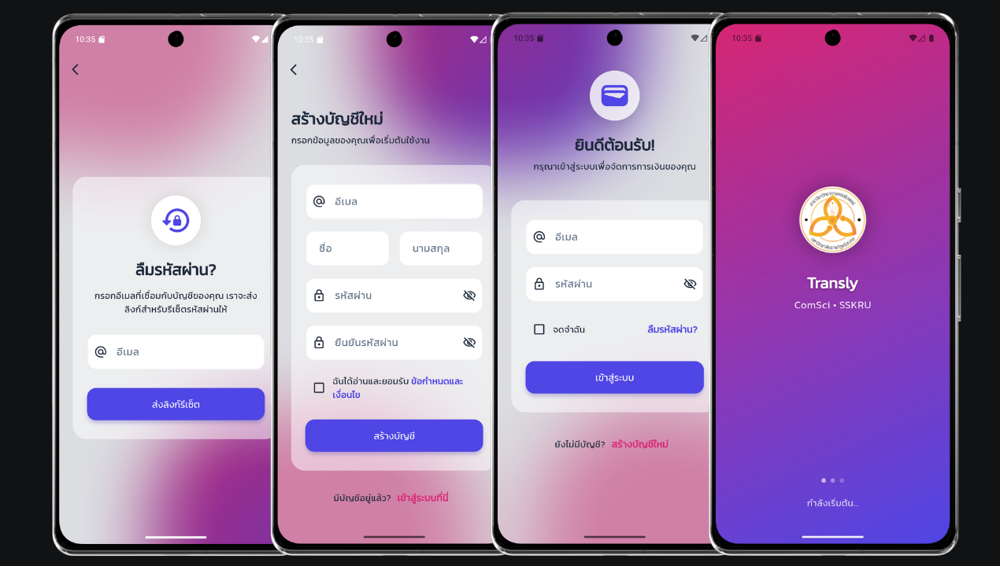
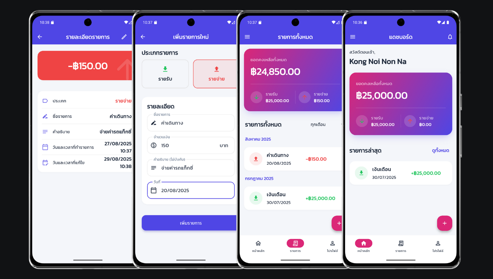

# Transly (Transaction Friendly): แอพจัดการธุรกรรมที่เป็นมิตรกับทุกคน

<div align="center">


**แอปพลิเคชัน Transly สำหรับจัดการและบันทึกการเงินส่วนบุคคล สร้างด้วย Flutter และ GetX**

[🚀 API](#-เอกสาร-api-api-documentation) • [📱 ฟีเจอร์](#-ฟีเจอร์หลัก) • [🏗️ โครงสร้าง](#-โครงสร้างโปรเจกต์-project-structure) • [✨ โค้ดตัวอย่าง](#-โค้ดตัวอย่างที่สำคัญ-code-highlights)

</div>

---

## 📖 เกี่ยวกับโปรเจกต์

**Transly** คือแอปพลิเคชันจัดการการเงินส่วนบุคคลที่ถูกสร้างขึ้นด้วยสถาปัตยกรรมที่ทันสมัยและยืดหยุ่น โดยมีเป้าหมายเพื่อให้ผู้ใช้สามารถบันทึก, ติดตาม, และวิเคราะห์รายรับ-รายจ่ายของตนเองได้อย่างง่ายดายและมีประสิทธิภาพ แอปพลิเคชันนี้เชื่อมต่อกับ Backend ผ่าน RESTful API, จัดการ State แบบ Reactive ด้วย GetX, และใช้ฐานข้อมูล Hive เพื่อให้สามารถทำงานได้แม้ในขณะออฟไลน์

### 🌟 จุดเด่นของโปรเจกต์

- ✅ **Clean Architecture:** แยกส่วนการทำงาน (UI, Business Logic, Services) ออกจากกันอย่างชัดเจน ทำให้ง่ายต่อการบำรุงรักษาและต่อยอด
- ✅ **Reactive State Management:** UI ทุกส่วนจะอัปเดตตามการเปลี่ยนแปลงของข้อมูลโดยอัตโนมัติ ทำให้แอปตอบสนองได้รวดเร็วและข้อมูลถูกต้องเสมอ
- ✅ **Component-Based UI:** สร้าง UI จาก Component ที่นำกลับมาใช้ใหม่ได้ ทำให้โค้ดกระชับและมีดีไซน์ที่เป็นเอกภาพ
- ✅ **Abstraction Layers:** มีการสร้าง Service และ Helper classes เพื่อ "ห่อหุ้ม" Logic ที่ซับซ้อน เช่น การเชื่อมต่อ API, การจัดการ Storage, และ Navigation ทำให้โค้ดในส่วน Controller สะอาดและอ่านง่าย

---

## 🚀 เอกสาร API (API Documentation)

หัวใจหลักของแอปพลิเคชันนี้คือการสื่อสารกับ Backend API ที่ถูกออกแบบมาอย่างดี

**Base URL:** [`https://transactions-cs.vercel.app`](https://transactions-cs.vercel.app)

### 🔐 Authentication Endpoints

| Method | Endpoint | คำอธิบาย | Body |
| :--- | :--- | :--- | :--- |
| `POST` | `/api/auth/login` | เข้าสู่ระบบผู้ใช้ | `{ "name": "...", "password": "..." }` |
| `POST` | `/api/auth/register` | สมัครสมาชิกใหม่ | `{ "name": "...", "password": "...", "first_name": "...", "last_name": "..." }` |

### 💰 Transaction Endpoints
*(ทุก Endpoint ในส่วนนี้ต้องมีการยืนยันตัวตน)*

| Method | Endpoint | คำอธิบาย | Headers |
| :--- | :--- | :--- | :--- |
| `GET` | `/api/transaction` | ดึงข้อมูลธุรกรรมทั้งหมด | `Authorization: Bearer {token}` |
| `POST` | `/api/transaction` | สร้างธุรกรรมใหม่ | `Authorization: Bearer {token}` |
| `PUT` | `/api/transaction/{uuid}` | แก้ไขธุรกรรม | `Authorization: Bearer {token}` |
| `DELETE` | `/api/transaction/{uuid}` | ลบธุรกรรม | `Authorization: Bearer {token}` |

---

## 📱 ฟีเจอร์หลัก

### 🔐 **ระบบสมาชิก (Authentication)**

- **การยืนยันตัวตน:** เข้าสู่ระบบ, สมัครสมาชิก, และลืมรหัสผ่าน
- **การจัดการ Session:** ล็อกอินอัตโนมัติเมื่อกลับเข้าแอป และออกจากระบบพร้อมล้างข้อมูล

### 💸 **การจัดการธุรกรรม (Transaction Management)**

- **CRUD Operations:** สร้าง, อ่าน, อัปเดต, และลบรายการธุรกรรม
- **การแสดงผล:** Dashboard สรุปยอด, รายการธุรกรรมทั้งหมด, และรายละเอียดแต่ละรายการ
- **การจัดกลุ่มและกรอง:** จัดกลุ่มรายการตามเดือนและปี พร้อมตัวกรอง (Filter) เพื่อการค้นหาที่ง่ายขึ้น

### 🎨 **UI/UX และการออกแบบ**

- **Modern Design:** ออกแบบด้วย Material Design 3 พร้อม Animation และเอฟเฟกต์ Glassmorphism
- **Consistent Theme:** กำหนด Theme กลาง (สี, ฟอนต์, สไตล์) เพื่อให้มีดีไซน์ที่เป็นเอกภาพ
- **User Feedback:** จัดการสถานะ Loading, Empty, และ Error เพื่อแจ้งให้ผู้ใช้ทราบอย่างชัดเจน

---

## 🛠️ เทคโนโลยีและ Dependencies

### `pubspec.yaml`
```yaml
dependencies:
  flutter:
    sdk: flutter
  flutter_localizations:
    sdk: flutter
    
  # Core
  get: ^4.7.2
  hive: ^2.2.3
  hive_flutter: ^1.1.0
  http: ^1.5.0
  path_provider: ^2.1.4
  intl: ^0.20.2
  collection: ^1.19.1
  
  # UI
  google_fonts: ^6.2.1
  flutter_animate: ^4.5.0
  flutter_slidable: ^3.1.0

# Assets
flutter:
  uses-material-design: true
  assets:
    - assets/images/
```
---

## 🏛️ สถาปัตยกรรมและหลักการออกแบบ

โปรเจกต์นี้ถูกสร้างขึ้นโดยใช้หลักการออกแบบที่ทันสมัย เพื่อให้โค้ดมีความน่าเชื่อถือ, ทดสอบง่าย, และง่ายต่อการต่อยอดในอนาคต

- **MVVM with GetX:** ใช้สถาปัตยกรรม Model-View-ViewModel โดยมี `Controller` ของ GetX ทำหน้าที่เป็น ViewModel จัดการ State และ Business Logic แยกออกจาก UI (View) อย่างชัดเจน
- **Service/Repository Pattern:** แยก Logic เฉพาะทางออกเป็น Service classes เช่น `ApiService` สำหรับการสื่อสารกับ Network และ `StorageService` สำหรับการจัดการ Local Database ทำให้ Controller ไม่ต้องรับภาระหนักเกินไป และสามารถสลับการทำงานเบื้องหลังได้ง่าย
- **Dependency Injection (DI):** ใช้ `Get.put()` และ `Get.find()` ในการจัดการ Dependencies ทำให้ลดการผูกมัดระหว่าง Class และง่ายต่อการทำ Unit Test
- **Component-Based UI:** ออกแบบ UI โดยแบ่งเป็น Component ย่อยๆ ที่นำกลับมาใช้ใหม่ได้ (`TransactionCard`, `UserProfileCard`) ช่วยลดความซ้ำซ้อนและทำให้โค้ดฝั่ง UI สะอาด

---

## 📁 โครงสร้างโปรเจกต์ (Project Structure)

```
lib/
├── 🚀 main.dart                   # จุดเริ่มต้นแอป, ตั้งค่า Global Theme, Dependency Injection และ Routes
├── 🧩 components/                 # UI Components ที่สร้างขึ้นเพื่อใช้ซ้ำในหลายๆ หน้า
│   ├── drawer.dart               # Navigation Drawer (เมนูซ้ายมือ)
│   ├── transaction_card.dart     # การ์ดแสดงผลสำหรับ 1 ธุรกรรม (รองรับการปัด)
│   ├── transaction_form.dart     # ฟอร์มสำหรับกรอกข้อมูลธุรกรรม (ใช้ทั้งหน้าเพิ่มและแก้ไข)
│   ├── transaction_summary_card.dart # การ์ดสรุปยอดเงิน (รายรับ, รายจ่าย, คงเหลือ)
│   └── user_profile_card.dart    # การ์ดแสดงข้อมูลโปรไฟล์ของผู้ใช้
├── 🎮 controllers/                # ViewModel: จัดการ State และ Business Logic ของแอป
│   ├── auth_binding.dart         # ผูก AuthController เข้ากับ Route
│   ├── auth_controller.dart      # Logic ทั้งหมดของระบบสมาชิก (Login, Register, Logout)
│   ├── transaction_binding.dart  # ผูก TransactionController เข้ากับ Route
│   └── transaction_controller.dart # Logic ทั้งหมดของการจัดการธุรกรรม (CRUD, คำนวณยอด)
├── 📊 models/                     # Model: กำหนดโครงสร้างข้อมูล
│   ├── transaction_model.dart    # โครงสร้างข้อมูลของธุรกรรม (พร้อม fromJson/toJson)
│   └── user_model.dart           # โครงสร้างข้อมูลของผู้ใช้ (พร้อม fromJson/toJson)
├── 🧭 routes/                     # กำหนดและจัดการหน้า (Navigation Routes)
│   ├── app_pages.dart            # กำหนด List ของ GetPage ทั้งหมด พร้อม Binding และ Transition
│   └── app_routes.dart           # เก็บค่าคงที่ของชื่อ Route ทั้งหมด ป้องกันการพิมพ์ผิด
├── 📱 screens/                    # View: หน้าจอหลักต่างๆ ของแอปพลิเคชัน
│   ├── forget_pass.dart          # หน้าจอสำหรับลืมรหัสผ่าน
│   ├── home.dart                 # หน้าจอหลัก (Dashboard)
│   ├── login.dart                # หน้าจอเข้าสู่ระบบ
│   ├── profile_screen.dart       # หน้าจอโปรไฟล์ผู้ใช้
│   ├── regis.dart                # หน้าจอสมัครสมาชิก
│   ├── splash_screen.dart        # หน้าจอแรกสุด พร้อม Animation และการตรวจสอบ Session
│   ├── transaction_detail_screen.dart # หน้าจอแสดงรายละเอียดของธุรกรรม
│   ├── transaction_form_screen.dart   # หน้าจอสำหรับ "ห่อหุ้ม" TransactionForm component
│   └── transaction_list_screen.dart   # หน้าจอแสดงรายการธุรกรรมทั้งหมด (จัดกลุ่มและกรองได้)
├── ⚙️ services/                   # Service Layer (Repository): จัดการ Logic เฉพาะทาง
│   ├── api_service.dart          # จัดการการเชื่อมต่อกับ RESTful API ทั้งหมด
│   └── storage_service.dart      # จัดการการอ่าน-เขียนข้อมูลลง Local Storage (Hive)
└── 🛠️ utils/                      # Helper Functions และค่าคงที่ต่างๆ
    ├── api.dart                  # เก็บค่าคงที่ของ Base URL และ Endpoints
    ├── date_helper.dart          # ฟังก์ชันช่วยจัดการและจัดรูปแบบวันที่/เวลาภาษาไทย
    └── navigation_helper.dart    # ฟังก์ชันช่วยจัดการ Navigation และการแสดง Snackbar/Dialog
```

---

## ✨ โค้ดตัวอย่างที่สำคัญ (Code Highlights)

### 1. การจัดการสถานะแบบ Reactive ด้วย GetX
`TransactionController` แสดงการใช้ `.obs` เพื่อทำให้ List ของข้อมูลเป็นแบบ Reactive และใช้ `ever` worker เพื่อ "ฟัง" การเปลี่ยนแปลงสถานะ Login จาก `AuthController` และดึงข้อมูลใหม่โดยอัตโนมัติ

```dart
// lib/controllers/transaction_controller.dart
class TransactionController extends GetxController {
  var transactions = <Transaction>[].obs; // Reactive List
  final AuthController authController = Get.find<AuthController>();
  late Worker _authWorker;

  @override
  void onInit() {
    super.onInit();
    _authWorker = ever(authController.isLoggedIn, (isLoggedIn) {
      if (isLoggedIn) fetchTransactions();
      else transactions.clear();
    });
  }
  
  double get totalIncome => transactions.where((t) => t.type == 1).fold(0, (sum, t) => sum + t.amount);
}
```

### 2. Service Layer สำหรับจัดการ API
`ApiService` ทำหน้าที่เป็นตัวกลางในการสื่อสารกับเซิร์ฟเวอร์ทั้งหมด มีการจัดการ Header, Error Handling, และแยกเมธอดตาม HTTP Verb อย่างชัดเจน

```dart
// lib/services/api_service.dart
class ApiService {
  static Future<Map<String, String>> get headers async {
    final token = Get.find<StorageService>().getToken();
    final headers = {'Content-Type': 'application/json'};
    if (token != null) headers['Authorization'] = 'Bearer $token';
    return headers;
  }

  static Future<dynamic> get(String endpoint) async {
    try {
      final response = await http.get(Uri.parse('$BASE_URL$endpoint'), headers: await headers);
      if (response.statusCode == 200) return jsonDecode(response.body);
      // ... Error handling ...
    } catch (e) { /* ... */ }
  }
}
```

### 3. Abstraction Layer สำหรับ Navigation และ UI Feedback
`NavigationHelper` ห่อหุ้มการทำงานของ `GetX` ทำให้โค้ดส่วนอื่นเรียกใช้งานง่ายขึ้น และรับประกันว่า Snackbar หรือ Dialog จะมีหน้าตาเหมือนกันทั่วทั้งแอป

```dart
// lib/utils/navigation_helper.dart
class NavigationHelper {
  static void showSuccessSnackBar(String message) {
    _showCustomSnackbar(
      title: 'สำเร็จ',
      message: message,
      accentColor: Colors.green,
      icon: Icons.check_circle_rounded,
    );
  }

  static void _showCustomSnackbar(...) {
    Get.snackbar(
      // ... Custom styling ...
    );
  }
}
```
### 📦 ขั้นตอนการติดตั้ง

```bash
# 1. Clone a repository
git clone [https://github.com/][YOUR_USERNAME]/transly-api-app.git

cd transly-api-app

# 2. ติดตั้ง Dependencies ทั้งหมด
flutter pub get

# 3. รันแอปพลิเคชัน
flutter run
```

---

## 📸 ตัวอย่างภาพหน้าจอ (Screenshots)



## 📸 ตัวอย่างภาพหน้าจอ (Screenshots)



---

## 🚀 การติดตั้งและรัน

### 📋 ความต้องการของระบบ

- **Flutter SDK**: version 3.0.0 ขึ้นไป
- **IDE**: Android Studio หรือ Visual Studio Code

---

## 📄 License

MIT License

Copyright (c) 2025 [Transly]

Permission is hereby granted, free of charge, to any person obtaining a copy
of this software and associated documentation files (the "Software"), to deal
in the Software without restriction, including without limitation the rights
to use, copy, modify, merge, publish, distribute, sublicense, and/or sell
copies of the Software, and to permit persons to whom the Software is
furnished to do so, subject to the following conditions:

The above copyright notice and this permission notice shall be included in all
copies or substantial portions of the Software.

---

## 👨‍💻 ผู้พัฒนา (Developed By)

<div align="center">

🧑‍🎓**ทีมงานก้องน้อยนอนนา**

🎓**สาขาวิทยาการคอมพิวเตอร์ & คณะศิลปศาสตร์และวิทยาศาสตร์**

🏫**มหาวิทยาลัยราชภัฏศรีสะเกษ**

**Happy Coding! 🚀**

</div>